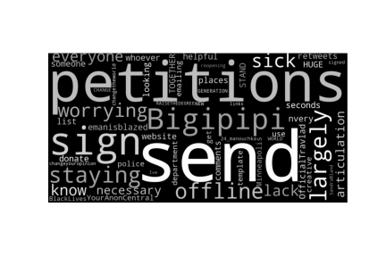
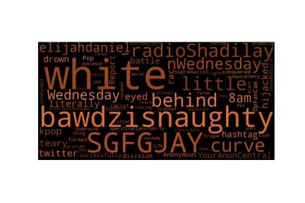

# Sentiment Analysis on Black Lives Matter tweets

## Problem Overview
This sentiment analysis is performed on a collection of 80.000 tweets collected from 2020-05-31 to 2020-06-08 about the `Black Lives Matter` movement. This movement is a decentralized political and social movement advocating for non-violent civil disobedience in protest against incidents of police brutality and all racially motivated violence against black people [1]. It was born in 2013 but it (sadly) became well known all over the word after the murder of George Floyd on 2020-05-25.

The tweets were already classified as:
* `1`, if they show a positive sentiment towards the movement
* `0`, if they show a negative sentiment towards the movement

Each tweet is described by 28 features and it is possible to see them on the Tweet Object Documentation [2], but for the current analysis we focused  just on the `full_text` feature, that contains the text of the tweet. 

The problem is well `balanced`, in fact there are 80.000 tweets, 40.069 classified as 0 and the remaining 39.931 as 1. It is interesring to see that there was a strong activity during this week, in fact we have found in this sample a number of retweets equal to 981.031.288. Then, the daily activity increased until 2020-06-03 where it reached its peak and it strongly decreased until the last day to our disposal.

We have also analyzed the most frequent words inside both categories and you can see it in Figure 1 and 2. In particular they are both "coherent" with what we could expect from them. In fact for the "positive" tweets we can see words as "petitions", "everyone", "together", while for the ones against the movement there are words as "white", "division", "behind" and so on.  

Figure 1 - Positive WordCloud           |  Figure 2 - Negative WordCloud  
:-------------------------:|:-------------------------:
  |  

## Proposed Approach

### Data Preprocessing
Natural Language Processing tasks have a canonical preprocessing structure, in fact in order to analyze a collection of document we should consider several consecutive steps. In particular when we deal with huge documents, we can actually \textit{split} them in shorter pieces in order to better analyze their content. Since this is not the case, we skipped to the second step, that is the \textit{tokenization}: here we split each content into tokens (a.k.a words). These tokens will represent the "core" of our analysis, because some of these tokens will be strictly related to our class. 

In particular we used the \textit{Natural Language Tool Kit tokenizer}, that allows to easily convert a sentence like "we are equal" into the following array of features ["we","are","equal"]. 

The aim of any sentiment analysis is to extract the most relevant "tokens" for each class. In this case, the most relevant tokens are the ones that are very frequent in a class and not frequent in the second one. In order to count the relative frequency of each token, we used the fairly well known \textit{TfIdfVectorizer} defined in scikit-learn. TF states for term frequencies and IDF states for inverse document frequency. In short, it penalize the tokens that are frequent in all the documents (our tweets), and it is defined as :
  

  

where `t` is the token, `d` is the current document, and `D` is the collection of `m` documents.  In particular we adopted the `stemming` and the `n-grams` implementation. The stemming comes from linguistic and it extracts the root form for each word, for example "consult, consulting, consultant" will all be treated as "consult", in order to unify analogous words. Then, the n-grams are all combinations of adjacent words or letters that can be extracted from the initial text. In particular we considered unigrams, bigrams and threegrams, by defining the range (1,3). To be more precise, we actually tried to remove also the stopwords, that are the most common words present in the English grammar (articles, noun, pronoun and so on) but we noticed a decrease in performance. It is due to the fact that probably the stopwords that we used contained some relevant words for our analysis. 

### Model Selection
he proposed approach has been tested on two classifiers:

* `logistic regression`: a linear model used to estimate the probability that an istance belongs to a particular class by computing a weighted sum of the input features and returns the logistic of its result,
* `multinomial naive bayes classifier`, a classifier that lays its foundations on the bayes theorem and on the assumptions of the mutually indipendent from the features. This classifier is fairly used in natural language processing because of its semplicity, in fact it is also much faster than the logistic regression.

A good compromise between accuracy and speed should be taken into account for business oriented application, because sometimes an accurate model could be so expensive for a real word application. Then, for both classifiers, the best hyperparameters configurations was defined through a grid search, explained in detail in the following section. 

### Hyperparameters Tuning
There have been defined two sets of different hyperparameters, defined in Table 1. The grid search trains the model with all the possible configurations and measure its performance by using the cross validation method. This method randomly split the entire dataset into k folds, train the model on k-1 folds and test it with the remaining one. This process is repeated until each fold has been tested. At the end of the process, it is possible to select the best configuration (the one that performs the best score) and use it for testing the evaluation test.

| Model  | Hyperparameters | Values  | 
| ------------- | ------------- | ------------- | 
| LogisticRegressor | C   penalty |  {1e-03, 1e-02, ... , 1e+03}   {l1,l2} | 
| MultinomialNB | alpha   fit_prior   | {0.5,0.7,...,1.5}    {True,False} | 

## Results
The reference metric was the accuracy and the best configuration for the `LogisticRegression` was `{'C':1000.0, 'penalty':'l2'}` obtained a score of `0.93`. It outperformed the `Multinomial Naive Bayes classifer` that scored `0.906` with `{'alpha':0.5, 'fit_prior':True}`. Then, they both outperformed their equivalent naive solutions, where we just tokenized the corpus, avoidind sophisticated techniques as we explained before. It scored 0.926 with the LogisticRegression and 0.894 with the MultinomialNB, that are not so far from the our best one. 

## Discussion
The Natural Language Processing is a wide and interesting field, with several application on our lives, in fact we will make some others analysis in order to learn new things and to discover new interesting insights. Anyway, the current approach obtained an overall satisfactory result, and it probably also depends on the goodness of the provided dataset. Possible improvement could regard the preprocessing phase, by considering some other raffinate techniques. Then it should be useful to focus on new models and their response to the different "combinations" of preprocessing. 

[1] Wikipedia 'Black Lives Matter' Phil. Trans. Roy. Soc. London, vol. A247, pp. 529--551, April 1955.
[2] Tweet Object Documentation : https://developer.twitter.com/en/docs/twitter-api/v1/data-dictionary/object-model/tweet

* [Code](https://github.com/francescodisalvo05/Twitter-Black-Lives-Matter-SA/blob/main/twitter-black-lives-matter.ipynb)
* [IEEE Standard Report](https://github.com/francescodisalvo05/Twitter-Black-Lives-Matter-SA/blob/main/BlackLivesMatter_SA.pdf)
